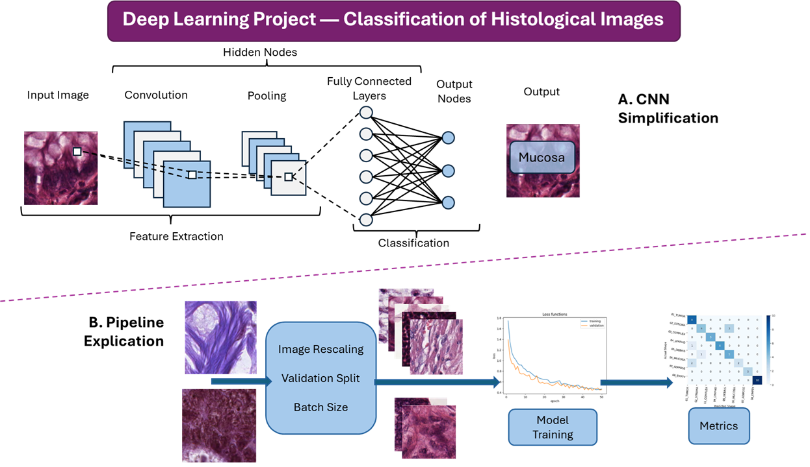

# 🧬 Histological Image Classification using Convolutional Neural Networks

This repository contains a complete end-to-end deep learning project for **multi-class classification of histological microscopy images**.  
The workflow includes dataset loading, preprocessing, visualization, CNN model construction, training, evaluation, and interpretability.

The project is implemented in **TensorFlow/Keras** and was originally executed in **Google Colab**.

---

## 📌 Project Objective

Develop, train, and evaluate a convolutional neural network capable of classifying colorectal cancer histology textures into **8 tissue categories**, using the **Kather 2016** dataset.

The model performs supervised multi-class classification on 150×150 H&E-stained microscopy tiles.

---

## 📊 Dataset

**Source:**  
Kather, J. N. et al. *Multi-class texture classification in colorectal cancer histology*.  
Zenodo: https://zenodo.org/record/53169

**Details extracted from script:**
- **Download size:** 246.14 MiB  
- **Dataset size:** 179.23 MiB  
- **Image dimensions:** 150×150 RGB  
- **Classes (8):**  
  - 01_TUMOR  
  - 02_STROMA  
  - 03_COMPLEX  
  - 04_LYMPHO  
  - 05_DEBRIS  
  - 06_MUCOSA  
  - 07_ADIPOSE  
  - 08_EMPTY  

The project automatically downloads and extracts the dataset.

---

## 🧪 Pipeline Overview

The project implements a full deep-learning workflow:

### **1. Data Loading & Exploration**
- Automatically downloads the dataset from Zenodo
- Counts images and loads folder structure
- Displays random histology samples
- Visualizes one example from each class

### **2. Data Preprocessing**
- Images resized to **128×28**
- Normalization using `rescale=1./255`
- Split using `validation_split=0.3`
- Batch size: **50**
- Data generators for training and validation

### **3. Model Architecture**

A custom CNN consisting of:
- 3× convolution blocks (32 → 64 → 128 filters)
- MaxPooling layers
- Dropout (0.3 and 0.5)
- Fully connected dense layer (256 units)
- Softmax output for multi-class prediction
- Compiled using:
  - **loss:** categorical_crossentropy
  - **optimizer:** Adam (learning rate 0.0001)
  - **metrics:** accuracy

### **4. Training**
- 50 epochs
- Early stopping with patience of 10
- Real-time validation monitoring

### **5. Evaluation**
- Training/validation loss curves
- Confusion matrix visualization
- Classification report:
  - Precision
  - Recall
  - F1-score

---

## 📈 Results 

- **Macro-Precision:** ~0.89  
- **Macro-Recall:** ~0.85  
- **Macro-F1:** ~0.85  
- Best performing classes show clear morphological separation  
- Worst classification: **Mucosa**, due to similarity with other epithelial tissues  

---

## 🧠 Interpretation & Analysis

The project discusses:
- Strengths (regularization, stability, generalization)
- Weaknesses (mucosa confusion)
- Limitations of dataset size and domain shift
- Need for external validation
- Suggested improvements:
  - Stain normalization
  - Grad-CAM interpretability
  - Deployment pipeline (SavedModel / ONNX)

---

## 📂 Workflow




---

## 🚀 Getting Started

### Clone the Repository

```bash
git clone https://github.com/JimmyBelt/Histology-Project.git
cd Histology-Project
```

## 📄 License

This project is licensed under the MIT License – see the [LICENSE](./LICENSE) file for details.

👤 Author

Jaime Beltrán Sánchez

Email: jaime120901@gmail.com

GitHub: https://github.com/JimmyBelt


---

**Note**: This project is for research purposes. Clinical use requires proper validation and regulatory approval.